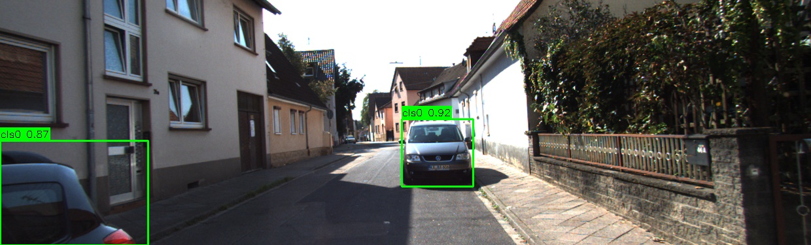
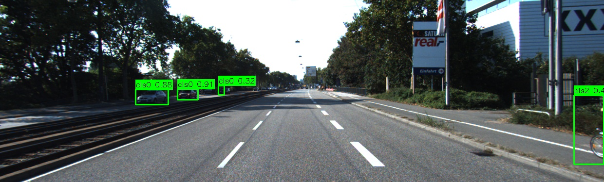
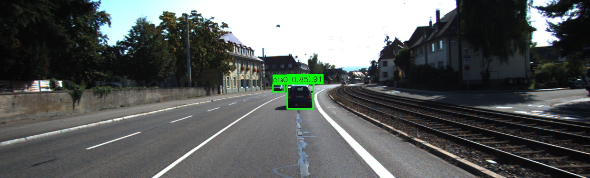
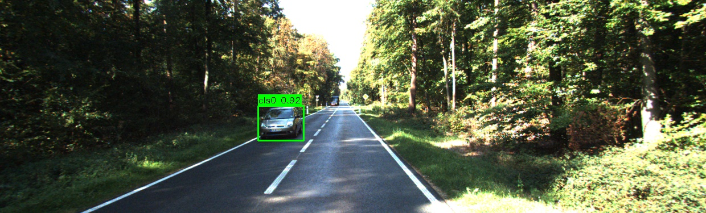
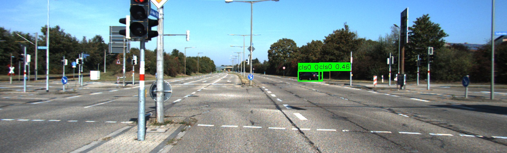
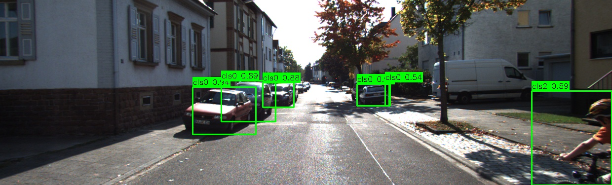
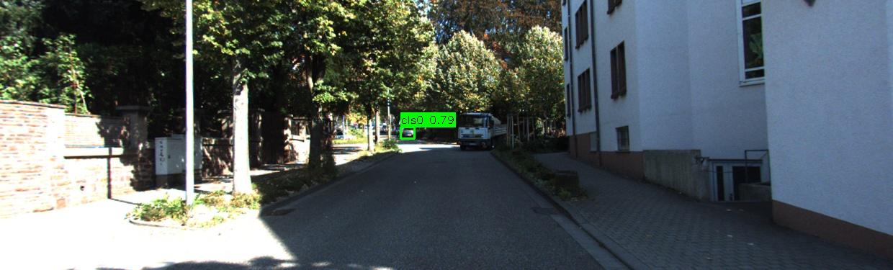

# Project-1_Object-Detection-2D-

This project focuses on training a 2D object detection model (YOLOv12 Nano) on the KITTI vision benchmark dataset. It includes scripts for data formatting, image tiling (mosaicking) for small-object detection optimization, model training, and post-processing evaluation.


## Dataset Information

The model is trained on the KITTI Object Detection benchmark. Because the official KITTI test set does not provide ground-truth labels to the public, the original `training` set (7,481 images) is split into an 80% internal training set and a 20% internal validation set. Also, the KITTI internal evaluation cannot be run as it is only reserved for testing new inventions and this isn't a new SOTA model research project.

### Image size distribution (train set):
(1224, 370): 751 images
(1242, 375): 5895 images
(1238, 374): 344 images
(1241, 376): 291 images

---

## Project Structure and Execution

To reproduce the results, execute the project scripts in the following order:

### 1. Data Conversion
**Script:** `convert_kitti.py`

* **Purpose:** Converts the original KITTI label format (TXT) into the standard YOLO normalized format and splits the 7,481 dataset images into an 80/20 train/val split.
* **Input:** `data/raw/training/image_2/` and `data/raw/training/label_2/`
* **Output:** Generates `data/images/train/`, `data/images/val/`, `data/labels/train/`, and `data/labels/val/`. It also generates a `val_ids.txt` file which contains the chosen ids of the validation set.

### 2. Image Mosaicking (Tiling)
**Script:** `mosaic.py`

* **Purpose:** Because the original images are very wide (~1242x375) and YOLO resizes inputs to square dimensions (e.g., 640x640), this script splits the images horizontally into overlapping 640x640 patches. This prevents small objects (like distant pedestrians) from being compressed into a few pixels.
* **Logic:** Uses a horizontal tiling strategy with a **70px overlap** to ensure objects on the "seam" are not cut in half. Vertical tiling is skipped as the image height is already well below 640px.
* **Output:** Generates the `mosaics/images/` and `mosaics/labels/` directories.

### 3. Model Training
**Script:** `train_yolo.py`

* **Purpose:** Trains the YOLOv12 Nano (`yolo12n.pt`) model using transfer learning on the mosaic dataset.
* **Features:** Automatically detects available GPU memory to dynamically set the maximum stable batch size. Implements mixed precision training (`half=True`) and rectangular training (`rect=True`) training time optimization.
* **Configuration:** Relies on `yolo.yaml` for class mapping and data paths.

### 4. Validation & Inference
**Script:** `validate.py`

* **Purpose:** Runs regular (non-KITTI script) validation and generates bounding box visualizations.
* **Features:** Stitches the 640x640 inference tiles back into the original full-width KITTI images. Applies Non-Maximum Suppression (NMS) across the 70px overlap zones to remove duplicate detections.

### 5. Evaluation
**Script:** `run_evaluation.py`

* **Purpose:** Executes a localized KITTI evaluation protocol to benchmark model performance. It calculates official Average Precision (AP) metrics across stratified difficulty levels (Easy, Moderate, Hard)
* **Features:** Computes Average Precision (AP) for three classes (**Car**, **Pedestrian**, **Cyclist**) using the 41-point interpolated precision method. Automatically categorizes performance into **Easy**, **Moderate**, and **Hard** levels based on object height, occlusion levels, and truncation levels defined by the KITTI benchmark.

**Inputs:**
* **Ground Truth:** data/raw/training/label_2` (Original KITTI labels).
* **Predictions:** output/run_1/labels_kitti_format` (Model output converted to 16-column KITTI schema).

**Outputs:**
* **Statistical Table:** Generates a Average Precision (AP) table in the terminal for quantitative analysis.
* **Visual Results:** Produces three Precision-Recall (PR) curve graphs (`pr_curves_easy.png`, `pr_curves_moderate.png`, `pr_curves_hard.png`).

### 6. Converting YOLO predictions to KITTI format for evaluation
**Script:** `yolo_to_kitti_format.py`

* **Purpose:** Convert predictions from YOLO format to KITTI format for evaluation.
**Inputs:**
* **Source Directory:** `output/run_1/labels`
**Outputs:**
* **Target Directory:** `output/run_1/labels_kitti_format`

---

## Data folder structure

The data structure of the project right before model training. This assumes that `convert_kitti.py` and `mosaic.py` have been executed correctly.

```
project-root/
├── data/
|   ├── raw/ 
│   │   ├── training/       # The KITTI dataset image and label folder which contains the training images and labels. Note that the test set was ignored (as its unlabeled)
|   │   │   ├── image_2/              
|   │   │   ├── label_2/              
│   ├── images/
│   │   ├── training/       # KITTI training images (split subset for internal training)
│   │   └── val/            # KITTI validation/internal test images
│   └── labels/
│       └── training/       # YOLO labels corresponding to training images
│       └── val/
└── mosaics/
    ├── images/
    │   ├── training/       # Mosaic-generated training tiles (640x640) from data/images/training
    │   └── val/            # Mosaic-generated validation tiles from data/images/test
    └── labels/
        └── training/       # YOLO labels for mosaic-generated training tiles
        └── val/ 
```

## Results

Below are sample visualizations of the detection system. These images represent the final output: the model performs inference on individual 640x640 mosaic tiles, which are then stitched back together with Non-Maximum Suppression (NMS) applied to the overlapping regions to ensure clean detections across the full KITTI images.

| Sample Detections |
| :---: |
|  |
|  |
|  |
|  |
|  |
|  |
|  |

---
